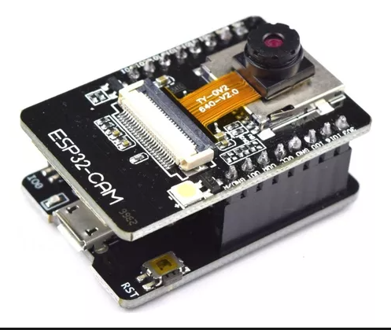

Sure! Let's add those instructions and acknowledgements into the README.md.

---

# ESP32CAM Streaming Project


This project enables the ESP32CAM to stream images from its camera over a Wi-Fi connection. The setup initializes the NVS (non-volatile storage), connects to Wi-Fi, initializes the camera, and sets up the web server to serve the video stream.

## Requirements


- ESP32CAM board.
- Development environment with PlatformIO and ESP-IDF.

## Features

- Initialize and setup NVS.
- Connect to a specified Wi-Fi network.
- Initialize and stream video from the ESP32CAM's camera.
- Web server to serve the video stream.

## Installation and Setup

### 1. Clone the Repository

```bash
git clone git@github.com:clausqr/esp32cam-webstream.git
cd esp32cam-webstream
```

### 2. Configuration

**WiFi Credentials:** In the repository, there is a file named `secrets.h.example`. Rename it to `secrets.h` and replace the placeholders with your Wi-Fi network credentials.

```c
#ifndef SECRETS_H
#define SECRETS_H

#define WIFI_SSID "replace_with_your_ssid"
#define WIFI_PASSWORD "replace_with_your_password"

#endif /* SECRETS_H */
```

### 3. PlatformIO Setup

Refer to the project's `platformio.ini` configuration provided earlier.

### 4. Compile and Upload

Compile and upload the code using the following commands:

```bash
platformio run --target upload
```

After the code is uploaded, open the Serial Monitor to view logs:

```bash
platformio device monitor
```

### 5. Accessing the Stream

Once the ESP32CAM is up and running, look for the IP address in the console output. Open that IP address in a web browser to watch the live stream.

## Troubleshooting

1. **Failed to connect with Wi-Fi**: Ensure that you've entered the correct Wi-Fi credentials and that the network is available and operational.
2. **Camera initialization error**: Ensure that the camera is properly connected and working.

## Contributing

If you'd like to contribute to this project, please fork the repository, make your changes, and submit a pull request.

**Issues and Pull Requests:** Feel free to open issues and submit pull requests to enhance the project. Your contributions are valued and will be reviewed.

## Acknowledgements

This code is a concoction of sources from several different online examples and repositories. The credit goes to all the original creators, mainly [https://github.com/espressif/esp32-camera](https://github.com/espressif/esp32-camera). clausqr <cmrosito@udesa.edu.ar> has merged these sources but takes no credit for the actual code. 
